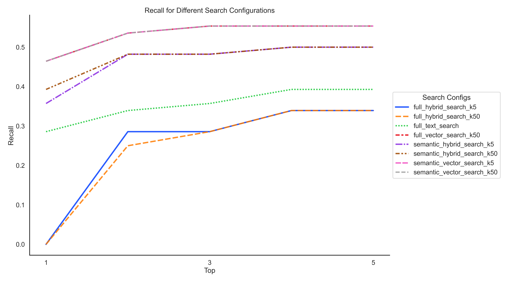

# Introduction

The core library of our Retrieval-Augmented Generation (RAG) Application is strategically developed to empower developers and researchers with robust tools for retrieval-based evaluation tasks. This library utilizes Azure AI Search capabilities to enable asynchronous document retrieval and evaluation, optimizing for scalability and performance in high-demand environments.

The primary aim of this library is to offer a comprehensive toolkit that facilitates the development, testing, and seamless deployment of retrieval systems integrated with generative models. This integration is vital in applications where precise and efficient information retrieval significantly boosts the relevance and performance of the generated content.

# Components

1. **AzureAISearchRetriever**: This component manages the asynchronous retrieval of documents from Azure AI's search services. It features built-in rate limiting to handle request concurrency, ensuring robust performance under varied load conditions.
2. **RetrievalEvaluator**: It evaluates the performance of the `AzureAISearchRetriever` using simulated queries and a DataFrame that assesses the accuracy of retrieved documents against specified ground truths. The evaluator employs multiple metrics to provide comprehensive analysis and insights into retrieval effectiveness.
3. **Metrics (RecallAtK)**: Metrics are crucial for assessing the performance of retrieval systems. `RecallAtK`, implemented within the library, measures the accuracy of information retrieval within the `top K` documents. This metric is essential for tuning the retriever to enhance precision in practical applications.
4. **Step Class**: The Step class forms the core architectural element of the library, standardizing the creation and integration of evaluators and metrics. This structure supports future enhancements, including monitoring and observability, to maintain and optimize system performance dynamically.

## The Step Class
The Step class is fundamental to the library's architecture, serving as the abstract base for all evaluative and operational components. It ensures consistency and reliability across the library, providing a standardized structure for all steps in the evaluation pipeline.

1. **Functionality**: Derived components like BaseEvaluator, BaseRetriever, and metric classes inherit a unified interface and foundational properties from the Step class, simplifying the development process by ensuring consistent initialization and functionality.
2. **Flexibility and Extensibility**: The use of the Step class allows for the seamless addition of new evaluative metrics or retrieval methods. Developers can easily introduce new subclasses that implement the abstract methods defined in the base Step class.
3. **Future Integration of Monitoring and Observability**: Designed with future enhancements in mind, the Step class is prepared to integrate advanced monitoring and observability features. This will allow for real-time tracking and analysis of system performance, essential for maintaining the efficiency and reliability of the retrieval processes in dynamic environments.

# Usage

This library is designed for high-level research and development projects requiring sophisticated and accurate retrieval systems. It is particularly suitable for scenarios that necessitate the integration with generative AI models, providing a crucial layer of retrieval capability that enhances the quality and relevance of generated outputs.

## Scripts
### Grid Search
The grid search script is a powerful tool designed to evaluate retrieval configurations for the RAG Application Core Library. It leverages the library's components to systematically explore various configurations of search parameters, measuring their effectiveness using the `RecallAtK` metric. The goal is to identify the best settings that maximize recall for different `k` values in retrieval tasks.

#### Components and Setup

##### Environment Setup
A .env.sample file contains all necessary environment variables. Users should create a .env file based on this template to specify parameters such as the
- Azure AI search base URL
- index name
- API version
- API key,
-RecallAtK metric's `k` value.

##### Scripts
1. **run_recall_at_k_grid_search.py**: This script performs the grid search over specified search configurations, evaluating each configuration's effectiveness in retrieving documents.
2. **plot_grid_search_k_curve.py**: After running the grid search, this script plots the results, displaying the mean recall for each `k` across different configurations. Here is a how the plot looks like:




#### Usage Instructions
1. Prepare the Environment: Fill out the .env file with the appropriate values for your Azure AI search service and desired evaluation settings. This setup includes details like the API base, index name, API version, API key, and columns used for ground truths and retrieval tasks.
2. Define Search Parameters: Create a JSON file detailing various search configurations to test. Each configuration should specify the retrieval parameters. Sample Search Params Json:
```json
[
    {"semantic_vector_search_k5": {"queryType": "semantic", "semanticConfiguration": "oai-semantic-config", "vectorQueries": [{"kind": "text", "text": "query", "k": 5, "fields": "chunk_vector"}]}},
    {"full_text_search": {"search": "query", "queryType": "full"}}
]
```

3. Run the Grid Search: Execute the grid search by running the following command, which requires paths to the dataset and the search parameters JSON file:

```python
python src\scripts\grid_search\run_recall_at_k_grid_search.py "path_to_dataset.xlsx" path_to_search_params.json
```

This command asynchronously runs the grid search using the specified DataFrame and search parameters, saving the results to a CSV file.

4. Visualize the Results: To visualize the outcomes of the grid search, use the following command, providing the path to the results DataFrame:
```python
python src\scripts\grid_search\plot_grid_search_k_curve.py "path_to_grid_search_results.csv"
```
This command generates a plot showing the recall performance for different search configurations, helping identify the optimal settings.

#### Explanation of the Code
1. **run_recall_at_k_grid_search.py**:
This script sets up the environment, loads the DataFrame and search configurations, and initializes components like the `AzureAISearchRetriever` and `RecallAtK` metric. It then performs the grid search over the search configurations, appending results to a DataFrame that is later saved.
2. **plot_grid_search_k_curve.py**:
This script reads the results DataFrame, calculates the mean recall for each `k` and configuration, and plots these values using Seaborn. The plot helps visualize the effectiveness of different configurations across various `k` values.

This grid search tool is an integral part of the RAG Application Core Library, designed to enhance retrieval accuracy through systematic and exhaustive configuration testing. By following the setup and usage instructions, users can efficiently optimize their retrieval systems for better performance in generative AI applications.


# Integration

Thanks to its modular design and well-documented interfaces, integrating this library into existing projects is straightforward. Users can customize the components to meet specific project requirements, whether adjusting the rate limiting on the AzureAISearchRetriever or enhancing the RetrievalEvaluator with new metrics for specialized evaluations.